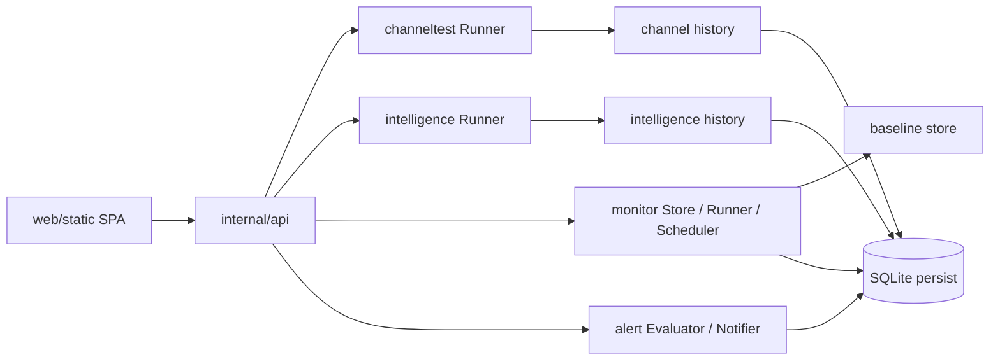
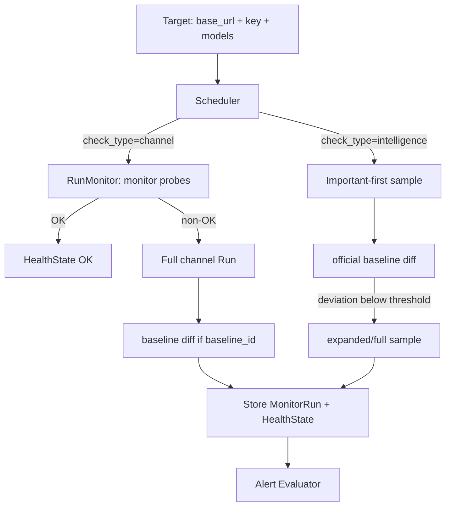

# 项目架构：Channel + Benchmark + Monitor

> 本文档依据当前工作树（2026-05-15）整理，重点描述 `internal/channeltest`、`internal/intelligence`、`internal/monitor`、`internal/persist` 与前端页面之间的职责边界。代码以当前仓库为准；官方链接只作为公共 API 行为参考，不用于证明本项目的私有指纹 heuristic。

## 1. 产品边界

本项目不是通用聊天网关，而是一个面向 Claude API 渠道的检测系统：

1. **Channel 检测**：判断一个目标 API 是否像真实 Anthropic/Claude 或官方兼容渠道。
2. **Benchmark / Intelligence 检测**：使用静态题库（当前以 SWE-Atlas-QnA 为主）评估模型输出，并和“官方 key 基线”对比。
3. **Monitor 长期检测**：把一次性 channel / benchmark 检测变成可调频率、可升级采样、可告警、可持久化的后台任务。
4. **Alert 告警**：根据 monitor run 与 health state 触发通知。
5. **Persist 持久化**：SQLite 记录目标、基线、运行历史、健康状态、告警、channel/intelligence 历史。

## 2. 一次性检测链路

### 2.1 Channel 一次性检测

入口：

- `POST /api/channel/run`
- `POST /api/channel/run/stream`
- `GET /api/channel/report`
- `GET /api/channel/history`

核心代码：

- `internal/channeltest/probe.go`：注册全部 probe，当前为 **15 个**。
- `internal/channeltest/phase_*.go`：每个 probe 的请求与检测逻辑。
- `internal/channeltest/check_registry.go`：check 的分类、显示名与默认修复动作。
- `internal/channeltest/suite.go`：probe 选择、并发、SSE 事件、评分与 report 组装。
- `internal/channeltest/profile.go`：console / bedrock / vertex / max profile 的降权/信息化规则。

当前 channel probe 执行顺序：

1. `precheck`
2. `tag_replay`
3. `mini_probe`
4. `identity_probe`
5. `self_intro`
6. `tool_use`
7. `logic`
8. `hidden_prompt`
9. `image_ocr`
10. `pdf_extract`
11. `magic_refusal`
12. `effort_thinking`
13. `signature_reject`
14. `bash_tool`
15. `minimal_tokens`

### 2.2 Benchmark / Intelligence 一次性检测

入口：

- `GET /api/intelligence/datasets`
- `POST /api/intelligence/datasets/{name}/run`
- `POST /api/intelligence/datasets/{name}/stream`
- `GET /api/intelligence/history`

核心代码：

- `internal/intelligence/types.go`：dataset / task / run request / run report / baseline comparison。
- `internal/intelligence/runner.go`：题目执行、并发、评分。
- `internal/intelligence/registry.go`：数据集注册。
- `internal/api/handler_intelligence.go`：同步与 SSE 运行、baseline comparison、历史保存。

设计原则：智商检测当前不需要引入更复杂动态 benchmark；静态 benchmark 足够，关键是保持同题、同模型、同 effort、同 max token 条件下和官方 key baseline 对比。

## 3. 长期检测链路

入口：

- `GET/POST /api/monitor/targets`
- `POST /api/monitor/targets/{id}/run`
- `GET /api/monitor/runs`
- `GET /api/monitor/status`
- `GET/POST /api/monitor/baselines`

核心代码：

- `internal/monitor/target.go`：target 配置，包括 check type、interval、baseline、benchmark 参数。
- `internal/monitor/scheduler.go`：定时 tick、jitter、并发限制、超时、backoff、按健康状态自适应频率。
- `internal/monitor/runner.go`：channel light-first、intelligence important-first、按 baseline deviation 升级。
- `internal/monitor/diff.go`：channel check diff 与 intelligence task diff。
- `internal/monitor/store.go`：内存 store + SQLite write-through。
- `internal/persist/schema.go`：SQLite DDL。

## 4. 前端职责

前端是纯静态 SPA，无构建步骤：

- `web/static/channel.js`：channel run / stream / history / retry。
- `web/static/bench.js`：benchmark dataset / task / SSE / history / baseline comparison。
- `web/static/monitor.js`：monitor target、baseline、status、runs。
- `web/static/util.js`：通用 UI 工具，并优先通过 `/api/meta/models` 加载后端模型能力元数据。

注意：模型能力、probe/check 元数据现在已有只读 API（`/api/meta/models`、`/api/channel/probes`、`/api/channel/checks`）。前端应优先消费这些后端单一真相源；`util.js` 中的本地模型表只作为离线/接口失败时的 fallback。

## 5. 官方 API 参考边界

本项目大量 check 属于本地经验型 heuristic。以下官方链接只能作为公共接口形态参考：

- Messages API：<https://docs.anthropic.com/en/api/messages>
- Streaming Messages：<https://docs.anthropic.com/en/docs/build-with-claude/streaming>
- Extended thinking：<https://docs.anthropic.com/en/docs/build-with-claude/extended-thinking>
- Tool use overview：<https://docs.anthropic.com/en/docs/agents-and-tools/tool-use/overview>
- Web search tool：<https://docs.anthropic.com/en/docs/agents-and-tools/tool-use/web-search-tool>
- Vision：<https://docs.anthropic.com/en/docs/build-with-claude/images-and-vision>
- PDF support：<https://docs.anthropic.com/en/docs/build-with-claude/pdf-support>
- Rate limits：<https://docs.anthropic.com/en/api/rate-limits>

凡是 `msg_01`、`req_01`、`inference_geo`、`stop_details`、`service_tier`、Cloudflare 头、私有 beta/tool 类型等检测，都应在本仓库文档中标为“本地 clean/reverse 对照经验”，不要写成官方公开承诺。
