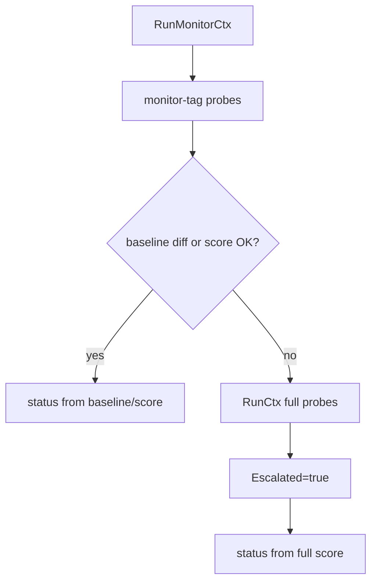
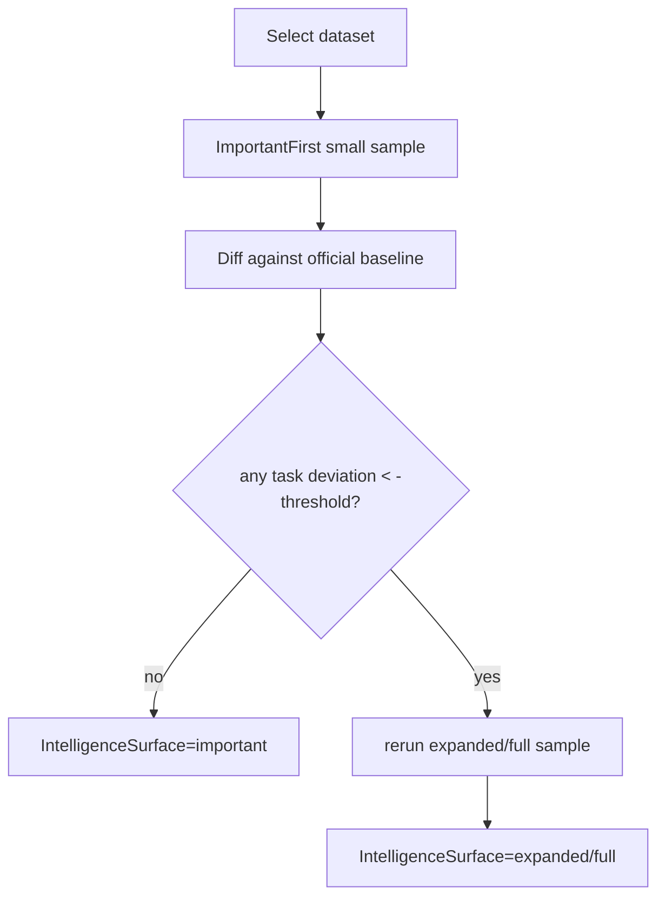

# 长期检测：轻量优先与按信号升级

## 1. 目标

长期检测的目标不是每轮都全量跑所有 probe/benchmark，而是在成本、频率、覆盖面之间取平衡：

1. 先跑低成本、高信号 surface。
2. 只有出现异常或相对官方 baseline 明显下降时，才升级到 full / expanded。
3. 用 health state、baseline diff 和 alert 形成闭环。

## 2. Channel staged monitoring

当前代码路径：`internal/monitor/runner.go -> runChannel()`

流程：



当前 monitor probe：

- `precheck`
- `mini_probe`
- `hidden_prompt`
- `magic_refusal`
- `signature_reject`（仅签名模型）
- `minimal_tokens`

升级条件：

- 有官方 channel baseline：light surface 出现 check regression，或分数相对 baseline 下降超过阈值。
- 无 baseline：回退到绝对 score，light report 非 OK 时升级。

## 3. Intelligence staged monitoring

当前代码路径：`internal/monitor/runner.go -> runIntelligence()`

流程：



关键参数：

| 字段 | 语义 |
|---|---|
| `intelligence_dataset` | 数据集名 |
| `intelligence_limit` | 初始 important-first 样本数，默认 3 |
| `intelligence_max_limit` | 升级样本数；0 表示全量 |
| `intelligence_threshold` | 相对官方基线的逐题下降阈值，默认 1.0 |
| `baseline_id` | 官方 key baseline |
| `effort` / `thinking_mode` / `max_tokens` | benchmark 参数 |

## 4. Scheduler 控制

当前 `Scheduler` 提供：

- 每 10 秒 tick。
- `targetID:model:checkType` 维度 dedupe，避免同一检测重复跑。
- `MaxConcurrent` 全局并发限制，默认 4。
- `RunTimeout` 单次运行超时，默认 5 分钟。
- 连续错误 backoff，默认 30s 起，最高 15m。
- `Jitter` 分散启动时间。
- 按 health state 自适应间隔：critical 更频繁，连续 OK 后拉长。

## 5. Health state 与 status

`HealthState` 维度：

```text
target_id + model + check_type
```

当前状态：`unknown` / `ok` / `warning` / `critical`。

Channel status 优先来自 baseline diff；没有 baseline diff 时回退到 score：

- baseline diff：无 regression 且分数未明显下降为 ok；少量 regression / 小幅下降为 warning；多项 regression / 大幅下降为 critical。
- score fallback：`>=80` ok，`>=50` warning，`<50` critical。

Intelligence status 当前优先看 baseline diff：有重叠题且平均下降达到阈值时 warning，否则 OK。

## 6. 成本与 rate-limit 注意事项

官方 rate limit 文档说明 API 会受请求速率和 token 维度限制。长期监控不能只看 scheduler 并发，还要考虑：

- 每 target 每日最大成本。
- 每模型每分钟请求数与 token 预算。
- 429 / overloaded / timeout 的区别。
- full escalation 冷却时间。
- heavy probe 默认禁止高频运行。

官方参考：<https://docs.anthropic.com/en/api/rate-limits>

## 7. 后续架构建议

1. 为 monitor target 增加每日预算与 full escalation cooldown。
2. 对 429 / 529 / timeout / auth error 分类记录，避免都变成同一种 critical。
3. 给每个 probe 增加更细的 `surface` / `cost_class` / `risk_class` 元数据，前端和 docs 共用。
